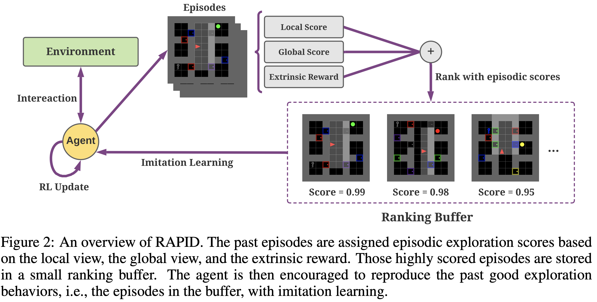
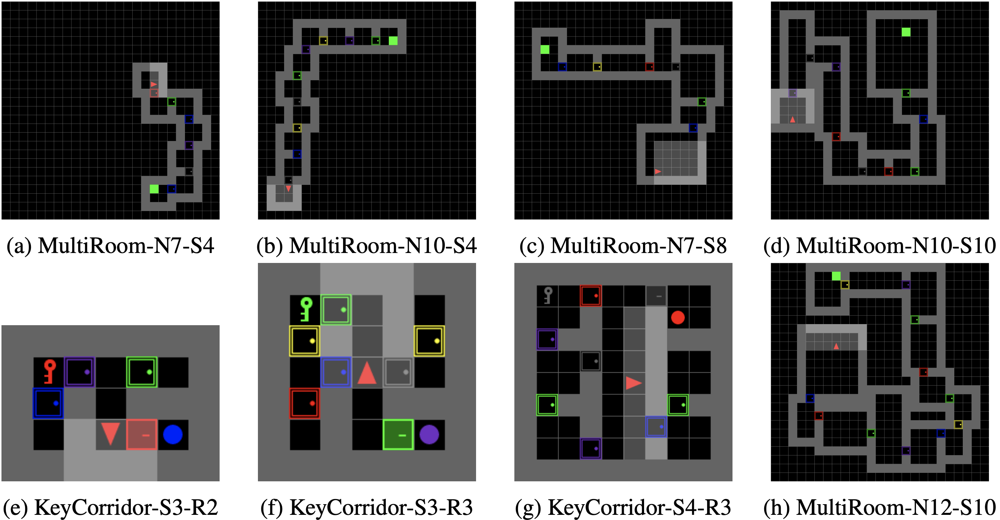
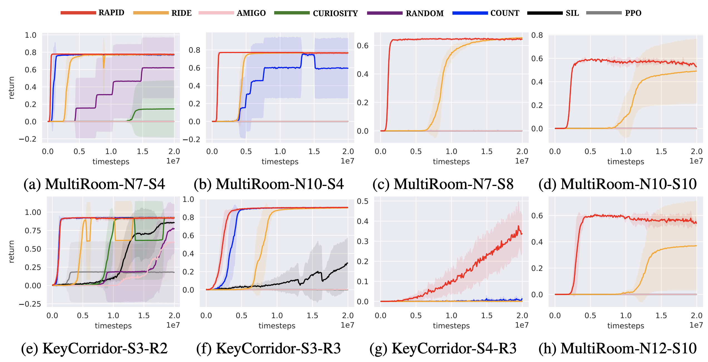

# [ICLR 2021] RAPID: A Simple Approach for Exploration in Reinforcement Learning
This is the Tensorflow implementation of ICLR 2021 paper [Rank the Episodes: A Simple Approach for Exploration in Procedurally-Generated Environments](https://openreview.net/forum?id=MtEE0CktZht). We propose a simple method RAPID for exploration through scroring the previous episodes and reproducing the good exploration behaviors with imitation learning.


The implementation is based on [OpenAI baselines](https://github.com/openai/baselines). For all the experiments, add the option `--disable_rapid` to see the baseline result. RAPID can achieve better performance and sample efficiency than state-of-the-art exploration methods on [MiniGrid environments](https://github.com/maximecb/gym-minigrid).



## Cite This Work
```
@inproceedings{
zha2021rank,
title={Rank the Episodes: A Simple Approach for Exploration in Procedurally-Generated Environments},
author={Daochen Zha and Wenye Ma and Lei Yuan and Xia Hu and Ji Liu},
booktitle={International Conference on Learning Representations},
year={2021},
url={https://openreview.net/forum?id=MtEE0CktZht}
}
```

## Installation
Please make sure that you have **Python 3.5+** installed. First, clone the repo with
```
git clone https://github.com/daochenzha/rapid.git
cd rapid
```
Then install the dependencies with **pip**:
```
pip install -r requirements.txt
pip install -e .
```
To run MuJoCo experiments, you need to have the MuJoCo license. Install `mujoco-py` with
```
pip install mujoco-py==1.50.1.68
```

## How to run the code
The entry is `main.py`. Some important hyperparameters are as follows.
*   `--env`: what environment to be used
*   `--num_timesteps`: the number of timesteps to be run
*   `--w0`: the weight of extrinsic reward score
*   `--w1`: the weight of local score
*   `--w2`: the weight of global score
*   `--sl_until`: do the RAPID update until which timestep
*   `--disable_rapid`: use it to compare with PPO baseline
*   `--log_dir`: the directory to save logs

## Reproducing the result of MiniGrid environments
For MiniGrid-KeyCorridorS3R2, run
```
python main.py --env MiniGrid-KeyCorridorS3R2-v0 --sl_until 1200000
```
For MiniGrid-KeyCorridorS3R3, run
```
python main.py --env MiniGrid-KeyCorridorS3R3-v0 --sl_until 3000000
```
For other environments, run
```
python main.py --env $ENV
```
where `$ENV` is the environment name.

## Run MiniWorld Maze environment
1. Clone the latest master branch of MiniWorld and install it
```
git clone -b master --single-branch --depth=1 https://github.com/maximecb/gym-miniworld.git
cd gym-miniwolrd
pip install -e .
cd ..
```
2. Start training with
```
python main.py --env MiniWorld-MazeS5-v0 --num_timesteps 5000000 --nsteps 512 --w1 0.00001 --w2 0.0 --log_dir results/MiniWorld-MazeS5-v0
```
For server without screens, you may install `xvfb` with
```
apt-get install xvfb
```
Then start training with
```
xvfb-run -a -s "-screen 0 1024x768x24 -ac +extension GLX +render -noreset" python main.py --env MiniWorld-MazeS5-v0 --num_timesteps 5000000 --nsteps 512 --w1 0.00001 --w2 0.0 --log_dir results/MiniWorld-MazeS5-v0
```

## Run MuJoCo experiments
Run
```
python main.py --seed 0 --env $env --num_timesteps 5000000 --lr 5e-4 --w1 0.001 --w2 0.0 --log_dir logs/$ENV/rapid
```
where `$ENV` can be `EpisodeSwimmer-v2`, `EpisodeHopper-v2`, `EpisodeWalker2d-v2`, `EpisodeInvertedPendulum-v2`, `DensityEpisodeSwimmer-v2`, or `ViscosityEpisodeSwimmer-v2`.
